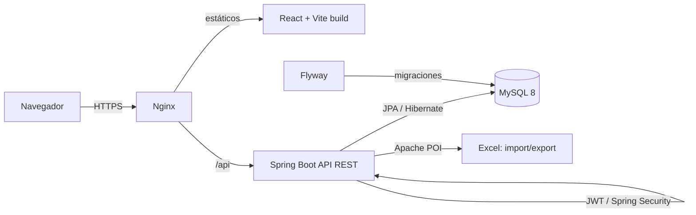

# Sistema de Gestión de Dosímetros

> Aplicación web para administrar el inventario, armado, asignación y trazabilidad
> de dosímetros de una empresa de dosimetría, reemplazando el proceso manual en Excel.

<p align="left">
  
  
  
  
  
</p>

---

## Tabla de contenido

- [¿De qué trata el proyecto?](#de-qué-trata-el-proyecto)
- [Características principales](#características-principales)
- [Módulos de la aplicación](#módulos-de-la-aplicación)
- [Roles y permisos](#roles-y-permisos)
- [Arquitectura](#arquitectura)
- [Stack tecnológico](#stack-tecnológico)
- [Estructura del repositorio](#estructura-del-repositorio)
- [Requisitos](#requisitos)
- [Puesta en marcha (desarrollo)](#puesta-en-marcha-desarrollo)
- [Variables de entorno](#variables-de-entorno)
- [Base de datos y migraciones](#base-de-datos-y-migraciones)
- [Tests](#tests)
- [Despliegue](#despliegue)
- [Documentación](#documentación)

---

## ¿De qué trata el proyecto?

Los **dosímetros** son dispositivos que miden la radiación a la que se expone una
persona. La empresa administra un gran inventario de dosímetros que se **asignan a
clientes** de sectores como salud, minería y construcción, se **reutilizan** entre
trimestres y se gestionan bajo distintas marcas comerciales.

Hasta ahora todo se llevaba en una planilla Excel de cientos de miles de filas:
lenta, difícil de consultar y propensa a errores. Este proyecto la reemplaza por una
**aplicación web** que centraliza y ordena todo el proceso:

- **Inventario y armado** de dosímetros (por tipo: OSL, TLD, Cristal, y su tipo de
  porta), organizados en tareas / bandejas / slots.
- **Asignación masiva** a clientes (cientos o miles a la vez) con validación de
  compatibilidad y de stock disponible.
- **Reutilización y trazabilidad**: cada dosímetro conserva su historial completo de
  asignaciones y ubicaciones.
- **Consulta por rol**: administradores y operadores gestionan todo; cada ejecutivo
  ve solo la información de sus clientes.
- **Dashboard** con indicadores y gráficos para la toma de decisiones.

## Características principales

- 📥 **Carga masiva** de dosímetros desde Excel, con plantilla descargable que incluye
  **listas desplegables** para tipo de dosímetro y tipo de porta.
- ✅ **Validación estricta ("todo o nada")**: si el archivo tiene filas erróneas, no se
  guarda nada y se muestra el detalle de cada error para corregirlo.
- 🧩 **Armado** por rango de bandeja/slot o slot a slot, incluida la opción de
  **des-armar** ("Sin armar") un rango.
- 🎯 **Asignación** masiva, individual y por archivo, con resumen exportable.
- ♻️ **Reutilización**: un dosímetro que vuelve de un cliente se re-arma y queda
  disponible; el historial de asignaciones se conserva.
- ⚠️ **Detección de duplicados físicos**: si un número ya existe armado en otra tarea,
  se avisa y se gestiona en el módulo Duplicados.
- 🔎 **Búsqueda** por número con historial completo y correcciones.
- 📊 **Dashboard** con KPIs, filtros reactivos por trimestre y detalle interactivo.
- 📤 **Exportaciones a Excel/CSV** de stock, asignaciones y clientes pendientes.
- 👥 Gestión unificada de **usuarios y ejecutivos**, clientes y tipos de porta.

## Módulos de la aplicación

| Módulo | Descripción | Roles |
|---|---|---|
| **Dashboard** | KPIs, gráficos y stock histórico, reactivos al trimestre. | Administrador |
| **Stock** | Inventario jerárquico (tipo → porta → tarea → bandeja → slot), carga y exportación. | Admin · Operador |
| **Armar** | Asigna el tipo de porta a los dosímetros de una tarea (rápido por rango o slot a slot). | Admin · Operador |
| **Asignar** | Asignación masiva / individual / por archivo, con resumen exportable. | Admin · Operador |
| **Dosímetros** | Búsqueda con filtros, historial, correcciones y edición de asignaciones. | Admin · Operador |
| **Pendiente de asignación** | Comparación cliente × trimestre; exporta clientes con los filtros aplicados. | Admin · Operador · Ejecutivo |
| **Clientes** | Alta y gestión de clientes con filtros. | Admin · Operador |
| **Duplicados** | Números repetidos en el sistema; permite sacar/backup uno de los dos. | Admin · Operador |
| **Tipos de porta** | Catálogo de portas por tipo de dosímetro. | Admin · Operador |
| **Importar Excel** | Carga masiva inicial de dosímetros. | Administrador |
| **Usuarios y ejecutivos** | Módulo unificado: cuentas de acceso (login + rol) y comerciales. | Admin (usuarios) · Operador (ejecutivos) |
| **Mis dosímetros / asignaciones / clientes** | Vistas de solo lectura del ejecutivo. | Ejecutivo |

## Roles y permisos

| Rol | Alcance |
|---|---|
| **Administrador** | Acceso total: catálogos, usuarios, stock, asignaciones y dashboard. |
| **Operador** | Armar y asignar dosímetros, gestionar clientes/ejecutivos/portas, ver todo. |
| **Ejecutivo** | Solo consulta de sus clientes y dosímetros asignados. |

El control de acceso se aplica en dos capas: **rutas protegidas** en el frontend y
**`@PreAuthorize`** por rol en cada endpoint del backend.

## Arquitectura



- **SPA React** servida como estáticos; consume la API vía `axios` con token **JWT**.
- **API Spring Boot** stateless; autenticación por JWT y autorización por rol.
- **MySQL 8** en producción; el esquema y los datos base los versiona **Flyway**.
- **H2 en memoria** para los tests (no requiere MySQL).

## Stack tecnológico

| Capa | Tecnología |
|---|---|
| Frontend | React 19 · Vite · Tailwind CSS · Recharts · React Router · Axios |
| Backend | Java 17 · Spring Boot 3 (Web, Data JPA, Security) |
| Seguridad | Spring Security + JWT · rate limiting de login |
| Datos | Hibernate · MySQL 8 (prod) · H2 (tests) · Flyway |
| Carga/Descarga Excel | Apache POI |
| Build | Maven (`mvnw`) · npm |

## Estructura del repositorio

```
dosimetros-sistema/
├── backend/          # API REST (Spring Boot) + migraciones Flyway + tests
│   ├── src/main/java/com/dosimetros/backend/
│   │   ├── controller/   # endpoints REST
│   │   ├── service/      # lógica de negocio
│   │   ├── repository/   # acceso a datos (Spring Data JPA)
│   │   ├── entity/       # entidades JPA
│   │   ├── dto/          # objetos de transferencia
│   │   └── security/     # JWT, filtros, rate limiter
│   └── src/main/resources/db/migration/   # V1..V5 (Flyway)
├── frontend/         # SPA (React + Vite)
│   └── src/{pages,components,api,auth}/
├── migracion/        # utilidades para migrar el histórico desde Excel
├── deploy/           # ejemplo de Nginx y guía de seguridad
└── docs/             # manual de usuario y propuesta comercial
```

## Requisitos

- **Java 17+** (el wrapper `mvnw` ya viene incluido)
- **Node 20+**
- **MySQL 8** (solo para ejecutar; los tests usan H2)

## Puesta en marcha (desarrollo)

Con MySQL en ejecución:

```bash
# Backend  → http://localhost:8080
cd backend && ./mvnw spring-boot:run

# Frontend → http://localhost:5173
cd frontend && npm install && npm run dev
```

Al primer arranque, **Flyway** crea el esquema y carga los catálogos base y un usuario
administrador inicial. **Las credenciales de acceso se entregan de forma interna y
deben cambiarse tras el primer ingreso** (ver [`deploy/SEGURIDAD.md`](deploy/SEGURIDAD.md)).

## Variables de entorno

La configuración (conexión a BD, secretos, orígenes CORS) se toma de **variables de
entorno**; en desarrollo hay valores por defecto. Plantilla completa en
[`backend/.env.example`](backend/.env.example):

| Variable | Descripción |
|---|---|
| `DB_URL`, `DB_USERNAME`, `DB_PASSWORD` | Conexión a MySQL. |
| `JWT_SECRET`, `JWT_EXPIRATION_MS` | Secreto (≥32 chars) y expiración del token. |
| `CORS_ALLOWED_ORIGINS` | Orígenes del frontend permitidos (coma-separados). |
| `JPA_SHOW_SQL`, `SECURITY_LOG_LEVEL` | Observabilidad / debug. |

## Base de datos y migraciones

El esquema y los datos base los gestiona **Flyway**
(`backend/src/main/resources/db/migration`, versiones `V1`–`V5`). Cada cambio de
esquema se agrega como una nueva migración versionada. Para migrar el histórico real
desde el Excel, ver [`migracion/README.md`](migracion/README.md).

## Tests

```bash
cd backend && ./mvnw test
```

**34 pruebas** que cubren la lógica crítica (importación/actualización de stock,
asignaciones, reglas de duplicados, seguridad de login) sobre **H2** — no requieren
MySQL.

## Despliegue

El sistema corre cómodo en una máquina pequeña (backend + MySQL + Nginx). Opciones,
de más simple a más control:

| Opción | Cómo | Costo mensual aprox. | Puesta en marcha |
|---|---|---|---|
| **Railway / Render** (PaaS) | Conectas el repo; ellos compilan y despliegan. | US$ 10–25 | Horas |
| **AWS Lightsail** (VPS) ⭐ | 1 instancia dockerizada (backend + MySQL + Nginx), precio fijo. | US$ 12–24 | 1–2 días |
| **Hetzner / DigitalOcean** (VPS) | Igual que Lightsail, más económico. | €4–8 (Hetzner) | 1–2 días |

**Anexos:** dominio (~$10–15 mil CLP/año), **HTTPS gratis** con Let's Encrypt, backup
diario de la BD (`mysqldump`).

Recursos incluidos en el repo:

- Checklist de despliegue seguro: [`deploy/SEGURIDAD.md`](deploy/SEGURIDAD.md).
- Ejemplo de Nginx (sirve el frontend y reenvía `/api`):
  [`deploy/nginx.conf.example`](deploy/nginx.conf.example).

## Documentación

- 📘 **Manual de usuario** (por módulo y por rol): [`docs/MANUAL_USUARIO.md`](docs/MANUAL_USUARIO.md).
- 💼 **Propuesta comercial** (arriendo/SaaS + arquitectura de hosting):
  [`docs/PROPUESTA_COMERCIAL_ARRIENDO.md`](docs/PROPUESTA_COMERCIAL_ARRIENDO.md).

---

<sub>Proyecto interno de gestión de dosímetros · Dosimet.</sub>
